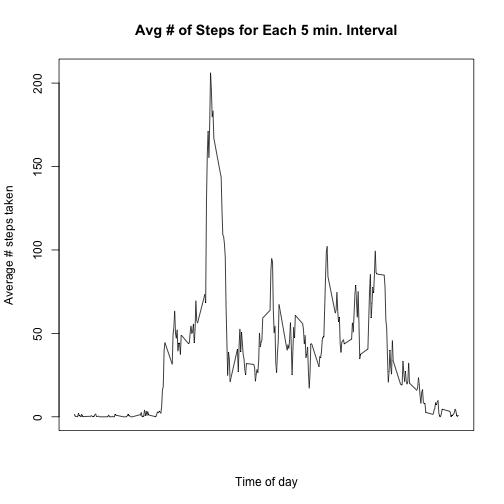
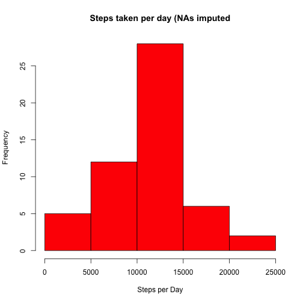
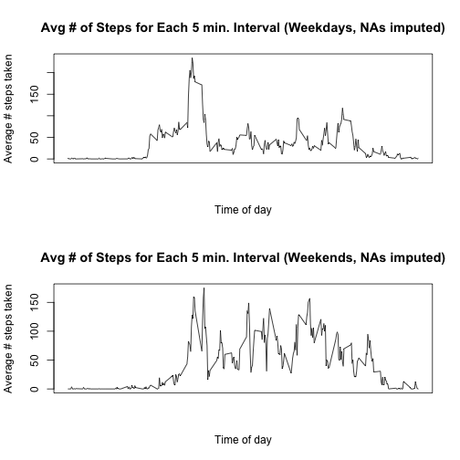

## Loading and preprocessing the data


```r
#First, download the file to the r working directory, unzip it, and save it as "activity.csv”. Then, get the csv with this command:
activity <-read.csv("activity.csv")
```


## What is mean total number of steps taken per day?
get the total # of steps taken per day


```r
stepsPerDay <- ddply(activity, .(date), summarize, stepsPerDay=sum(steps))

#plot a histogram of the steps perDay.
hist(stepsPerDay$stepsPerDay, col="red", xlab = "Steps per Day", ylab="Frequency", main="Steps taken per day")
```

 

```r
#get the median steps per day
medianStepsPerDay <- median(stepsPerDay$stepsPerDay, na.rm=TRUE)

#get the mean steps per day
meanStepsPerDay <- mean(stepsPerDay$stepsPerDay, na.rm=TRUE)
```


## What is the average daily activity pattern?

```r
#get the averages for each interval
intervalMeans <- ddply(activity, .(interval), summarize, stepsPerDay=mean(steps, na.rm=TRUE))

#plot the 5-minute interval and the average number of steps taken, averaged across all days 
plot(intervalMeans$interval, intervalMeans$stepsPerDay, type="l", xaxt = "n", xlab="Time of day", ylab="Average # steps taken", main="Avg # of Steps for Each 5 min. Interval")
```

 

```r
#find the 5 minute interval (on average across all days in the dataset), with the maximum # of steps taken
rowNum   <- which.max(intervalMeans$stepsPerDay)
maxInterval <- intervalMeans[rowNum,1]
```


## Imputing missing values

```r
#find out how many complete cases we have (rows that have no NAs in any of the columns)
dim(activity[complete.cases(activity),])
```

```
## [1] 15264     3
```

```r
#output: [1] 15264     3
dim(activity)
```

```
## [1] 17568     3
```

```r
#output: [1] 17568     3

#So, we have 17568-15264=2304 incomplete rows in the data set.

#####Filling in (imputing)  missing values
#Strategy for filling in missing values for the activity dataset:
#If the steps column is missing, I will use the average for the 
#5-minute interval in which it falls.

imvals <- aggregate(steps ~ date, data=activity, mean)
#rename the 2nd column of imvals
names(imvals)[2] <- "meanStepsForThatInterval"
combo <- merge(activity, imvals)
combo$steps[is.na(combo$steps)] <- combo$meanStepsForThatInterval[is.na(combo$steps)]
combo$meanStepsForThatInterval <- NULL

#create the histogram
stepsPerDayFilled <- ddply(combo, .(date), summarize, stepsPerDayFilled=sum(steps))
hist(stepsPerDayFilled$stepsPerDayFilled, col="red", xlab = "Steps per Day", ylab="Frequency", main="Steps taken per day (NAs imputed")
```

 

```r
#analysis: I see no discernable difference between the na-imputed data and the non-na-imputed data,
#suggested that perhaps my strategy of imputation wasn't bad (or, i'm missing something altogether)
```


## Are there differences in activity patterns between weekdays and weekends?

```r
#determine which of the dates are weekdays, and which are weekends.
dates <- as.Date(combo$date)
dates <- weekdays(dates)


for (i in 1:length(dates)) {
  if (dates[[i]] %in% c("Saturday", "Sunday")) {
		dates[[i]] <- "Weekend";
	}
		else {
			dates[[i]] <- "Weekday";
		}
}

combo$isWeekday <- dates
#break the data into two pieces: weekend and weekdays
weekdayData <- combo[combo$isWeekday == "Weekday",]
weekendData <- combo[combo$isWeekday == "Weekend",]

#average the 2 split data sets over each 5-minute interval
weekdayDataAveragedOverInterval <- ddply(weekdayData, .(interval), summarize, stepsPerDay=mean(steps, na.rm=TRUE))
weekendDataAveragedOverInterval <- ddply(weekendData, .(interval), summarize, stepsPerDay=mean(steps, na.rm=TRUE))

#plot the two pieces of data
par(mfrow=c(2,1))
plot(weekdayDataAveragedOverInterval$interval, weekdayDataAveragedOverInterval$stepsPerDay, type="l", xaxt = "n", xlab="Time of day", ylab="Average # steps taken", main="Avg # of Steps for Each 5 min. Interval (Weekdays, NAs imputed)")
plot(weekendDataAveragedOverInterval$interval, weekendDataAveragedOverInterval$stepsPerDay, type="l", xaxt = "n", xlab="Time of day", ylab="Average # steps taken", main="Avg # of Steps for Each 5 min. Interval (Weekends, NAs imputed)")
```

 
